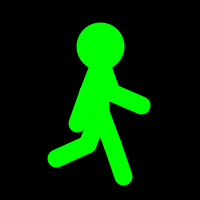

# Stickman Animation Project



## Project Description

The Stickman Animation project serves the purpose of generating an animation that can be transformed into a GIF for use in another project. It provides an entertaining visual experience by animating a stickman figure, showcasing various animation techniques.

## Features

- **Stickman Animation**: The project demonstrates how to animate a stickman figure, including its legs, arms, and head.
- **Smooth Graphics**: The animation uses smooth graphics to provide a visually pleasing experience.
- **Frame Saving**: It can save frames as images for creating a GIF.

## Getting Started

Follow these steps to set up and run the Stickman Animation project:

1. Clone the repository:
   ```bash
   git clone [repository URL]
   ```

2. Open the project folder in the Processing development environment.

3. Run the sketch by clicking the "Run" button or pressing `Ctrl+R` (or `Cmd+R` on macOS).

## Usage

Once you have the project running in the Processing environment, you can observe the stickman animation. The stickman will perform a walking animation with swinging arms and bending knees. The animation will continue indefinitely until you manually stop it.

Additionally, the project is configured to save the first 120 frames as image files (PNG format). You can find these images in the project directory with filenames like "sticky-######.png," where `######` represents a unique frame number.

## Contributing

Contributions to this project are not currently accepted, as it's primarily designed for educational and demonstration purposes. However, you are welcome to fork the project and create your own variations or improvements.

## License

This project is open-source and available under the MIT License. You are free to use, modify, and distribute it as per the terms of the license. See the [LICENSE.md](LICENSE.md) file for details.